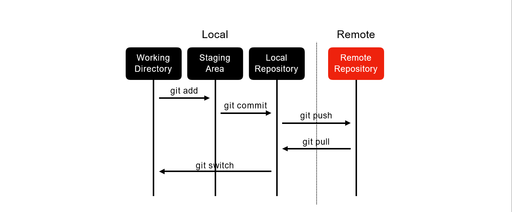

# Git 기초 정리

## Date
2024년 6월 26일

## 목차

- [Git이란](#git이란)
- [Git 기본 설정](#git-기본-설정)
- [기본명령어](#기본-명령어)
- 
- 원격 저장소 연동

##  Git이란?

Git은 **분산 버전 관리 시스템(DVCS)**으로, 코드 변경 사항을 추적하고 여러 사람이 협업할 수 있게 도와줍니다.

## Git 기본 설정

- git config --global user.name "cjoh"
- git config --global user.email "ohchangjo@gmail.com"
- Git config --global core.editor "vim"
- Git config --global core.pager "cat"

## 기본 명령어
| 기능          | 명령어                            |
| ----------- | ------------------------------ |
| Git 저장소 초기화 | `git init`                     |
| 상태 확인       | `git status`                   |
| 변경 사항 추적    | `git add .` 또는 `git add <파일명>` |
| 커밋          | `git commit -m "메시지"`          |
| 로그 보기       | `git log`                      |
| 원격 저장소 연결   | `git remote add origin <url>`  |
| 푸시          | `git push -u origin main`      |
| 클론          | `git clone <url>`              |

## Git Local and Remote Repository

## .gitignore 파일 내용 자동 생성
| .gitignore 파일 내용 자동 생성 | https://www.toptal.com/developers/gitignore/ |
|--|--|